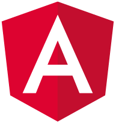
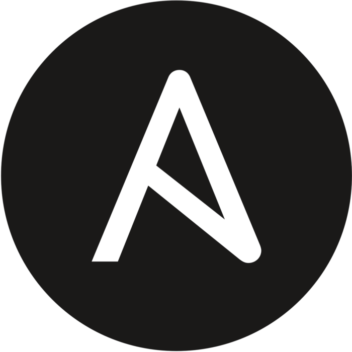

### Hi there, I'm Nutt Chairatana 👋

## I'm a fresh full stack developer!!

- 🔭 I’m studying at King Mongkut's Institute of Technology Ladkrabang
- 🌱 I’m currently learning new technologies to support my development skills!

### Connect with me:

[][website]
[][linkedin]

 

### Languages and Tools:

[]
[]
[]
[]
[]
[]
[]
[]
[]
[]
[]
[]
[]
[]
[]
[]
[]
[]

 
 

[website]: https://www.nuttchai.com
[linkedin]: https://www.linkedin.com/in/nuttchai/

<!--
**nuttchai/nuttchai** is a ✨ _special_ ✨ repository because its `README.md` (this file) appears on your GitHub profile.

Here are some ideas to get you started:

- 🔭 I’m currently working on ...
- 🌱 I’m currently learning ...
- 👯 I’m looking to collaborate on ...
- 🤔 I’m looking for help with ...
- 💬 Ask me about ...
- 📫 How to reach me: ...
- 😄 Pronouns: ...
- ⚡ Fun fact: ...
-->
