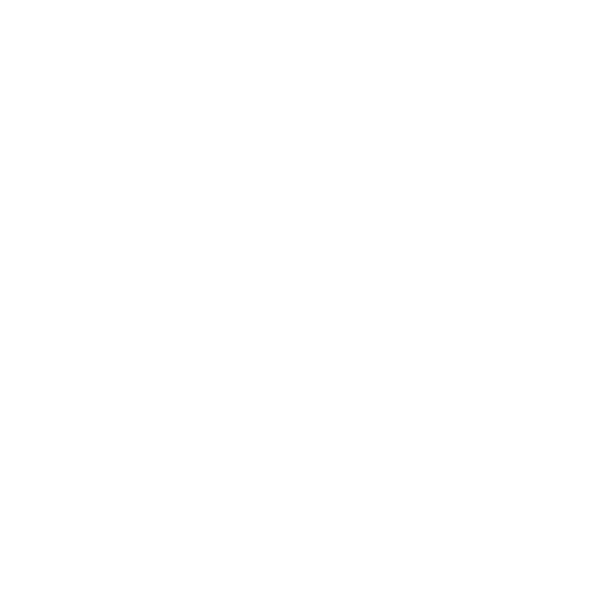

# 💬 Hi there, I'm Nutt, a software engineer!

- 🔭 I successfully completed my studies at King Mongkut's Institute of Technology Ladkrabang!
- 🌱 I am actively pursuing opportunities for professional growth and expanding my technical skill!
- ✨ My career aspiration is to attain excellence as a software engineer and ultimately become a highly regarded solution architect
- 🥅 2023 Goals: Obtain the AWS Solutions Architect Professional certification and further enhance my technical skills

## ✅ To-Do Lists

- [x] ~~Obtain AWS Solutions Architect Associate Certification~~
- [x] ~~Learn to create enterprise-based Golang unit test~~
- [ ] Initiate open-source contribution
- [ ] Obtain AWS Solutions Architect Professional Certification
- [ ] Obtain Kubernetes Certified Application Developer (CKAD)
- [ ] Complete System Design Interview – An Insider’s Guide -- Book by Alex Xu

## 🔧 Technologies & Tools


<br />


<br />


<br />


## 👯 GitHub Statistic


<!--START_SECTION:waka-->

```txt
From: 24 April 2022 - To: 12 November 2023

Total Time: 505 hrs 55 mins

Go                166 hrs 16 mins >>>>>>>>-----------------   32.86 %
Python            108 hrs 51 mins >>>>>--------------------   21.52 %
TypeScript        52 hrs 6 mins   >>>----------------------   10.30 %
JavaScript        38 hrs 20 mins  >>-----------------------   07.58 %
YAML              33 hrs 51 mins  >>-----------------------   06.69 %
Markdown          20 hrs 31 mins  >------------------------   04.06 %
SQL               12 hrs 5 mins   >------------------------   02.39 %
CSV               11 hrs 26 mins  >------------------------   02.26 %
HTML              11 hrs 25 mins  >------------------------   02.26 %
Bash              9 hrs 40 mins   -------------------------   01.91 %
```

<!--END_SECTION:waka-->

## &#x270d; Personal Blogs

Apart from coding, I also maintain blogs - you can find the articles via my [personal blog][medium]!

My example articles:

- ➰ [Principle of Computation and Application: Recursion](https://medium.com/@nuttchai/principle-of-computation-and-application-recursion-39ebf1fe0d88)
- 🔑 [Principle of Computation and Application: Hashing](https://medium.com/@nuttchai/principle-of-computation-and-application-hash-6965f15de2a0)
- 🌳 [Principle of Computation and Application: Tree](https://medium.com/@nuttchai/principle-of-computation-and-application-tree-1aaaefa51fdb)
- 📚 [Principle of Computation and Application: Stack, Queue](https://medium.com/@nuttchai/principle-of-computation-and-application-stack-queue-37bbbb754a13)

## 📫 Reach Out!

[][website-custom-icon]
[][website]
[][gitlab]
[][linkedin]
[][facebook]
[][medium]

[website-custom-icon]: https://www.nuttchai.com
[website]: https://www.nuttchai.com
[gitlab]: https://gitlab.com/nuttchai
[linkedin]: https://www.linkedin.com/in/nuttchai/
[facebook]: https://www.facebook.com/nchairatana
[medium]: https://medium.com/@nuttchai

<!--
**nuttchai/nuttchai** is a ✨ _special_ ✨ repository because its `README.md` (this file) appears on your GitHub profile.

Here are some ideas to get you started:

- 🔭 I’m currently working on ...
- 🌱 I’m currently learning ...
- 👯 I’m looking to collaborate on ...
- 🤔 I’m looking for help with ...
- 💬 Ask me about ...
- 📫 How to reach me: ...
- 😄 Pronouns: ...
- ⚡ Fun fact: ...
-->
